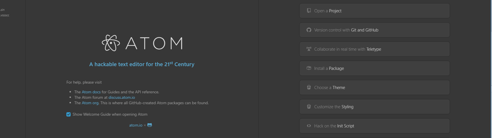
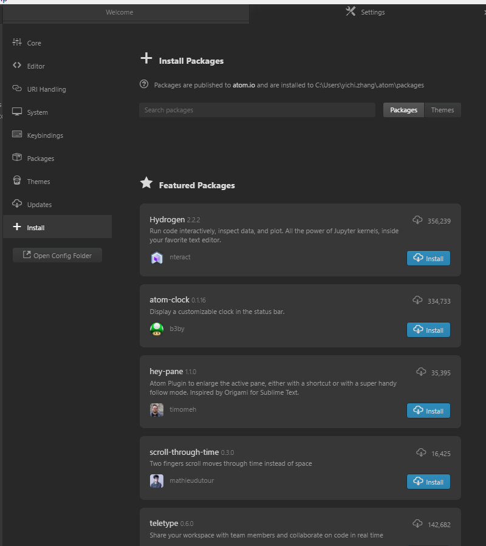
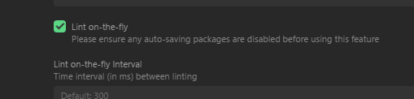
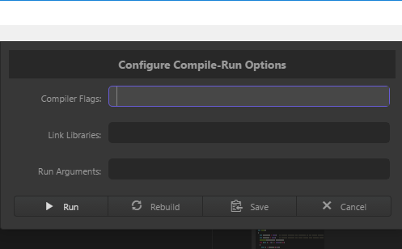

# Atom Guide  
Atom is a code editor developed by Github. If you want to use Atom to code, please refer to the following guide.

Before reading the instructions, you need to do some things first.  
+ Download and install Atom  
+ Install the C/C++ environment(the tutorial is in the repository)  

## Instructions  
1. At the main page of input, open the "install a package" tab and enter the package installation page.  
  
2. Install the following packages:
+ gcc-make-run  
+ linter  
+ linter-gcc
3. Open the "packages" tab on the left, and find linter-gcc package, get into the setting of it.  
   
4. Find the "lint-on-the-fly" checkbox and check it.  
   
5. The installation is completed. You can use Atom to write a C or C++ code and run it by clicking F6.  
6. For projects which contains various files, you should click ctrl+F6 nd put all .c/.cpp files other than the current file into the "Compiler Tags" blank and run.  
   