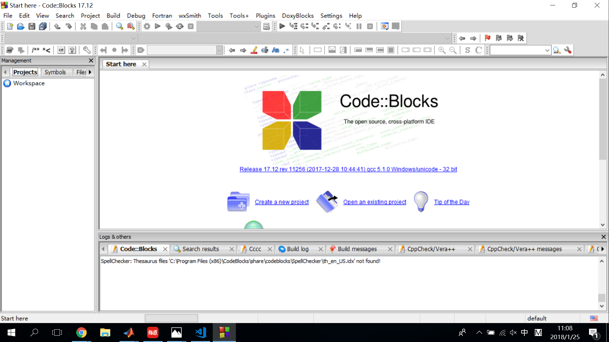
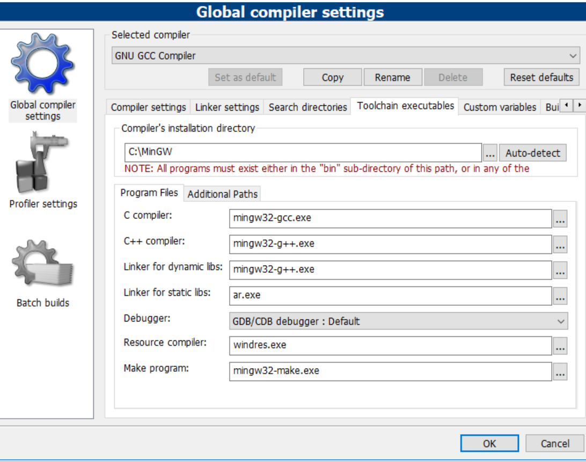

# Code::Blocks Guide  
Code::Blocks is a useful and light IDE for C and C++, and the here is the guide for configuring Code::Blocks  

Before rading the instructions, here some things you need to finish  
+ Download and install Code::Blocks(For Windows users, Code::Blocks has installers that can also install MinGW for you)  
+ Build the C/C++ environment  

## Instructions  
1. At the first time you launch Code::Blocks, it will automatically search for compilers in your computer. If your MinGW(Here it will be called GNU compiler) is found, then you can skip directly to step 5.  
    
2. If your compiler is not found, please open Settings-Compiler, and then open the "Toolchain executables" tab.  
3. Input your main directory of MinGW and then press Auto-detect.
4. If all your files in MinGW are found like this, your configuration of Code::Blocks is successful.  
    
5. If you want to run programs in Code::Blocks, you should first build a C/C++ project and then put all your .c/.cpp and .h files into the project. And then you just need to run the project.